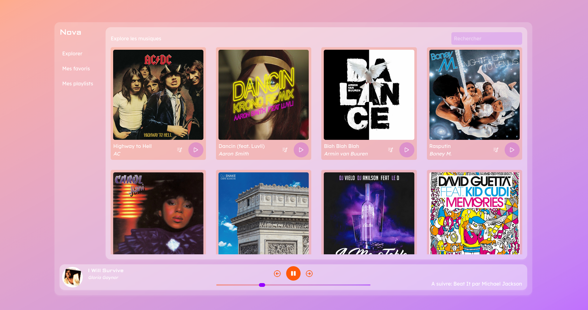
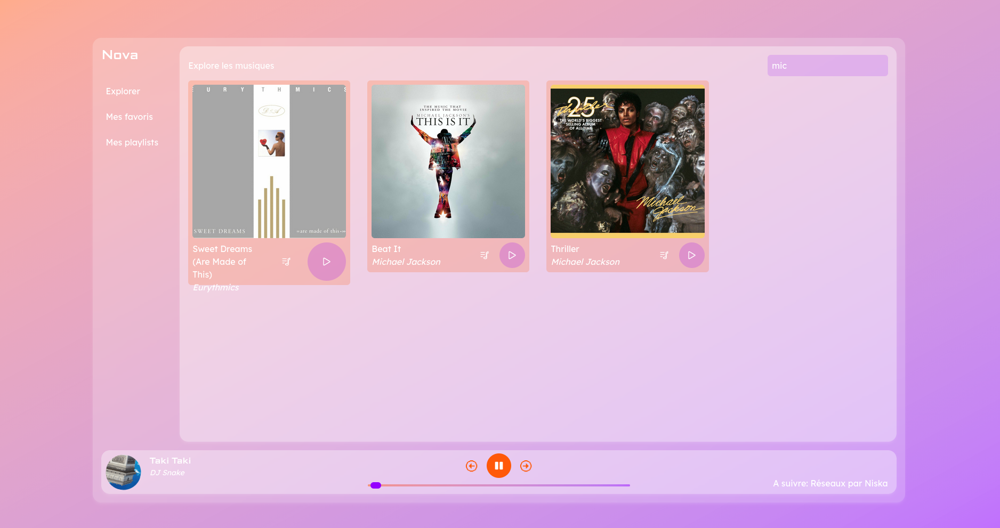
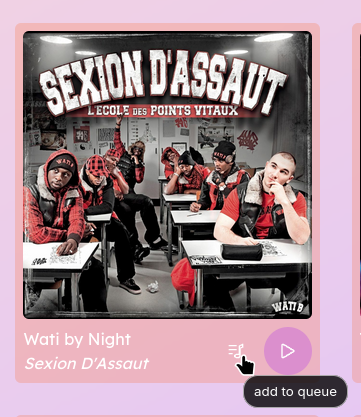

# Nova Simple Player

A very minimalist player built in VueJS for an educational workshop for my school.

## The workshop's theme

A startup wants to launch a music application.
The development teams have already made good progress with the application, but there remains a bug, a feature and 1 or 2 UI elements to be implemented.

## Project Setup

### Install dependencies

```sh
bun install
```

### Setup environnement variable

```sh
mv .env.exemple .env
```

### Compile and Hot-Reload for Development

```sh
bun dev
```

### Compile and Minify for Production

```sh
bun run build
```

## Features

### Working player



### Searchbar

Works with songs' names and artists' names



### Queue system

With previous/next playing and "add to queue" button


